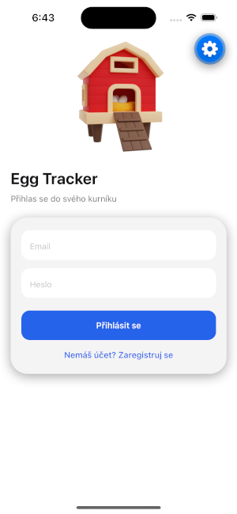
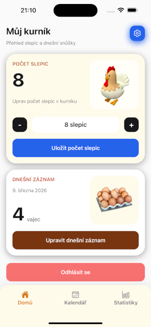
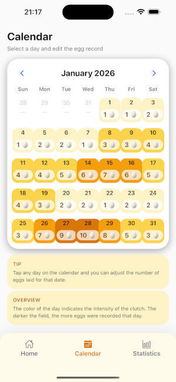
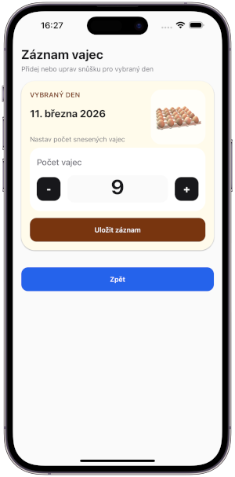
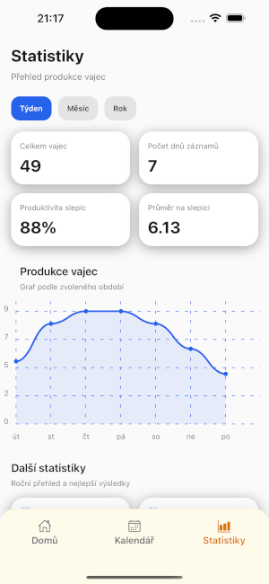
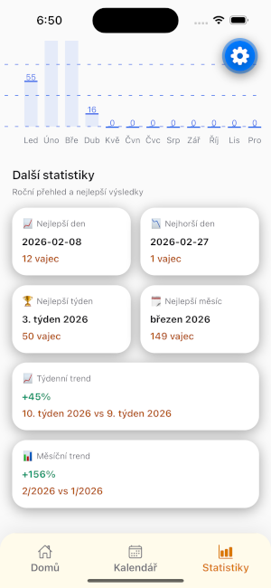

# 🥚 Egg Tracker

Mobile app for tracking egg production from backyard chickens.

---

## 📱 Screenshots

| Login | Home |
|------|------|
|  |  |

| Calendar | Add Eggs |
|------|------|
|  |  |

| Statistics |
|------|
|  |  |

---

## 🚀 Features

- 🥚 Egg tracking calendar
- 📊 Monthly and weekly statistics
- 🐔 Productivity analytics per chicken
- 📁 CSV export of all data
- ☁️ Firebase cloud sync
- 📅 Visual egg production heatmap

---

## 🧱 Tech Stack

**Frontend**

- React Native
- Expo
- NativeWind (Tailwind for RN)

**Backend**

- Firebase Authentication
- Firebase Firestore

**Libraries**

- React Navigation
- React Native Calendars
- React Native Chart Kit

## 🗺️ Roadmap

- Future improvements planned:
- Notifications for egg collection
- Multi-coop support
- Egg production predictions
- iOS support
- Multi-language CZ/EN/DE

## 📦 Installation
- APP is still in development but you can test it by download .apk on your android
- 📲 APK Test Link
- https://expo.dev/accounts/krejzy23/projects/egg-tracker/builds/8748e1e0-5507-4db4-aac8-420abae84591

## 👨‍💻 Author
- Created by Aleš Krejzl
