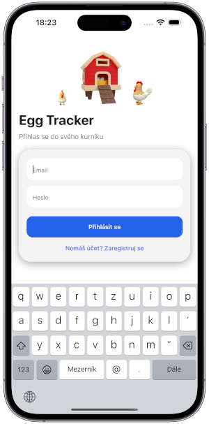
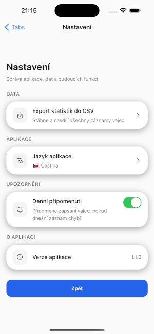
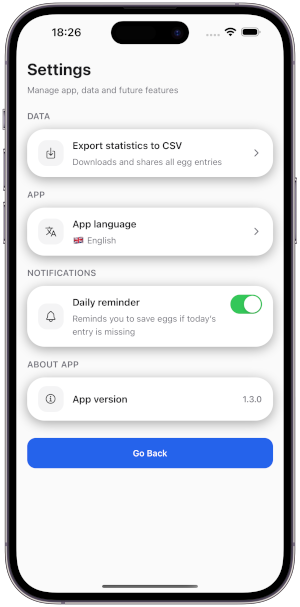
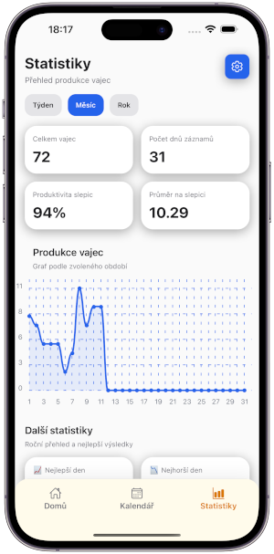
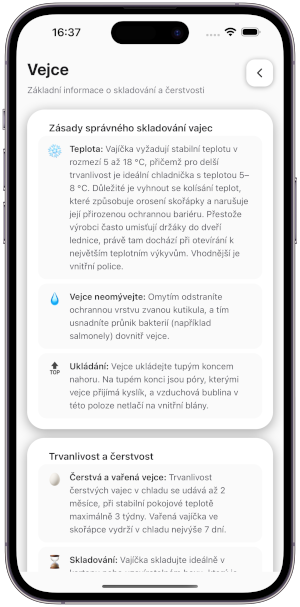
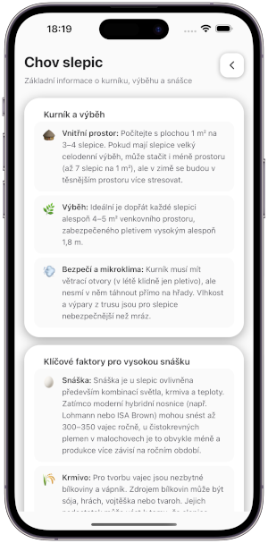

# 🥚 Egg Tracker

Mobile app for tracking egg production from backyard chickens.

---

## 📱 Screenshots

| Login                      | Login Auth                     |   Home Screen                 |
| -------------------------- | ------------------------------ | ----------------------------- |
|  |  |      |

| Calendar                      | Settings                      |  Settings EN                    |
| ----------------------------- | ----------------------------- | ------------------------------- |
|  |  | |

| Stats + WGraph              | Stats + MGraph              | Stats + Trends              |
| --------------------------- | --------------------------- | --------------------------- |
|  |  |  |

| Add Eggs                      |  Guide Eggs                     | Guide Chickens                   |
| ----------------------------- | ------------------------------- | ---------------------------------|
|  |  |  |

---

## 🚀 Features

- 🥚 Egg tracking calendar
- 📊 Monthly and weekly statistics
- 🐔 Productivity analytics per chicken
- 📁 CSV export of all data
- ☁️ Firebase cloud sync
- 📅 Visual egg production heatmap
- 📖 Guide to chickens and eggs
- 🇨🇿 Czech and 🇬🇧 English localization
---

## 🧱 Tech Stack

**Frontend**

- React Native
- Expo
- NativeWind (Tailwind for RN)

**Backend**

- Firebase Authentication
- Firebase Firestore

**Libraries**

- React Navigation
- React Native Calendars
- React Native Chart Kit

## 🗺️ Roadmap

**Future improvements planned:**
- Notifications for eggs collection - ✅
- Multi-language CZ/EN - ✅
- Add Guides - ✅
- iOS support - Work in progres....
- Egg production predictions
- Multi-coop support

## 📦 Installation

- APP is still in development but you can test it by download .apk on your android
- 📲 ANDROID APK Test Link
- v.1.3.0 - https://expo.dev/accounts/krejzy23/projects/egg-tracker/builds/440b4c06-bb20-4c9e-93e4-2f2c8c31c0c7

## 👨‍💻 Author

- Created by Aleš Krejzl
